# 🚀 Déploiement Portainer depuis GitHub - Guide Rapide

Ce guide montre comment déployer TimInvest sur Portainer **directement depuis GitHub** en quelques clics.

---

## ⚡ Avantages de cette méthode

- ✅ **Pas de copier-coller** de code
- ✅ **Mise à jour en 1 clic** depuis GitHub
- ✅ **Toujours à jour** avec la dernière version
- ✅ **Configuration centralisée** dans le repository
- ✅ **Traçabilité** des changements via Git

---

## 📋 Prérequis

1. Docker installé
2. Portainer installé et accessible

**C'est tout !** Portainer va construire l'image automatiquement depuis GitHub 🎉

---

## 🎯 Déploiement en 3 Étapes

### 1️⃣ Ouvrir Portainer

Ouvrez votre navigateur et allez sur :
- **http://localhost:9000** (installation locale)
- Ou **http://IP-SERVEUR:9000** (serveur distant)

### 2️⃣ Créer une Stack depuis GitHub

1. **Cliquez sur "Stacks"** dans le menu de gauche
2. **Cliquez sur "+ Add stack"**
3. **Remplissez les informations :**

| Champ | Valeur |
|-------|--------|
| **Name** | `timinvest` |
| **Build method** | Sélectionnez **"Repository"** |
| **Repository URL** | `https://github.com/SaohTG/timinvest` |
| **Repository reference** | `refs/heads/main` |
| **Compose path** | `docker-compose.portainer.yml` |
| **Authentication** | Laissez vide (repo public) |

4. **Cliquez sur "Deploy the stack"**

### 3️⃣ Attendre la construction

⏱️ **Première fois :** Portainer va construire l'image depuis le Dockerfile du repo. Cela prend 2-3 minutes.

Vous pouvez suivre la progression dans les logs :
- **Stacks** → **timinvest** → **Logs**

### 4️⃣ Accéder à l'application

Une fois la construction terminée, ouvrez : **http://localhost:8547**

---

## 🎨 Capture d'écran de Configuration

```
┌─────────────────────────────────────────────┐
│ Add stack                                    │
├─────────────────────────────────────────────┤
│ Name: timinvest                             │
│                                             │
│ Build method:                               │
│   ○ Web editor                              │
│   ● Repository          <-- Sélectionnez   │
│   ○ Upload                                  │
│                                             │
│ Repository URL:                             │
│ https://github.com/SaohTG/timinvest        │
│                                             │
│ Repository reference:                       │
│ refs/heads/main                             │
│                                             │
│ Compose path:                               │
│ docker-compose.portainer.yml                │
│                                             │
│ Authentication: (vide)                      │
│                                             │
│ [Deploy the stack]                          │
└─────────────────────────────────────────────┘
```

---

## 🔄 Mise à Jour de l'Application

C'est le **GROS AVANTAGE** de cette méthode ! 🎉

### Pour mettre à jour vers la dernière version :

1. Dans Portainer, allez dans **Stacks** → **timinvest**
2. Cliquez sur **"Pull and redeploy"** 
3. C'est tout ! ✅

Portainer va :
- 📥 Récupérer la dernière version depuis GitHub
- 🔨 Reconstruire si nécessaire
- 🚀 Redéployer automatiquement

**Plus besoin de :**
- ❌ Faire un `git pull` manuel
- ❌ Reconstruire l'image localement
- ❌ Modifier la stack dans Portainer
- ❌ Copier-coller du code

---

## 🔧 Personnalisation

### Modifier les variables d'environnement

Dans Portainer, lors de la création de la stack :

1. Scrollez jusqu'à **"Environment variables"**
2. Cliquez sur **"+ add environment variable"**
3. Ajoutez vos variables :

| Name | Value | Exemple |
|------|-------|---------|
| `FINNHUB_API_KEY` | Votre clé API | `votre_cle_ici` |
| `NEXT_PUBLIC_APP_URL` | URL publique | `https://invest.votredomaine.com` |

### Changer le port

Pour changer le port (si 8547 est déjà utilisé) :

1. Dans **Environment variables**, ajoutez :
   - Name : `PORT_EXTERNE`
   - Value : `9999` (ou votre port)

2. Ou éditez le fichier `docker-compose.portainer.yml` dans GitHub et mettez à jour

---

## 📊 Vérification

Dans Portainer → **Containers** :

| Indicateur | Valeur attendue |
|------------|----------------|
| **Container name** | `timinvest` |
| **Status** | 🟢 `running` |
| **Health** | ✅ `healthy` |

---

## 🌐 Workflows Recommandés

### Workflow de Production

```mermaid
graph LR
    A[Développement Local] --> B[Commit sur GitHub]
    B --> C[Push vers main]
    C --> D[Pull and redeploy dans Portainer]
    D --> E[Application mise à jour]
```



### Workflow avec Branches

Pour tester avant de déployer en production :

1. **Créez une branche de test :**
   ```bash
   git checkout -b test-nouvelle-feature
   git push origin test-nouvelle-feature
   ```

2. **Créez une 2e stack dans Portainer :**
   - Name : `timinvest-test`
   - Repository reference : `refs/heads/test-nouvelle-feature`

3. **Testez votre feature**

4. **Si OK, mergez dans main :**
   ```bash
   git checkout main
   git merge test-nouvelle-feature
   git push origin main
   ```

5. **Mettez à jour la prod :**
   - Stack `timinvest` → Pull and redeploy

---

## 🎯 Cas d'Usage Avancés

### Déploiement sur Plusieurs Serveurs

Vous avez 3 serveurs (dev, staging, prod) ? Utilisez des branches :

| Serveur | Branch | Stack Portainer |
|---------|--------|----------------|
| Dev | `develop` | `timinvest-dev` |
| Staging | `staging` | `timinvest-staging` |
| Production | `main` | `timinvest` |

Chaque serveur pointe vers sa branche et se met à jour indépendamment !

### Utiliser des Tags pour les Versions

Au lieu de `refs/heads/main`, utilisez un tag :

- Repository reference : `refs/tags/v1.0.0`

Cela vous permet de contrôler exactement quelle version déployer.

---

## 🐛 Résolution de Problèmes

### Erreur "Repository not found"

**Cause :** URL incorrecte ou repository privé

**Solution :**
- Vérifiez l'URL : `https://github.com/SaohTG/timinvest`
- Si le repo est privé, ajoutez l'authentification :
  - Username : votre nom GitHub
  - Personal Access Token : créez-en un sur GitHub

### Erreur "Compose file not found"

**Cause :** Chemin du fichier incorrect

**Solution :**
- Vérifiez que le fichier existe : `docker-compose.portainer.yml`
- Le chemin est relatif à la racine du repository

### La stack ne se met pas à jour

**Cause :** Portainer utilise un cache

**Solution :**
1. Stacks → timinvest → **Stop**
2. Puis → **Start**
3. Ou supprimez et recréez la stack

---

## 💡 Astuces Pro

### 1. Webhook Automatique

Configurez un webhook GitHub pour déployer automatiquement à chaque push :

1. Dans Portainer, lors de la création de la stack, activez **"Automatic updates"**
2. Copiez l'URL du webhook
3. Dans GitHub → Settings → Webhooks → Add webhook
4. Collez l'URL et configurez sur `push` events

Maintenant, chaque `git push` déploie automatiquement ! 🚀

### 2. Variables d'Environnement Secrets

Pour les clés API sensibles :

1. Dans Portainer → **Secrets**
2. Créez un secret : `finnhub_api_key`
3. Dans la stack, référencez-le :
   ```yaml
   environment:
     - FINNHUB_API_KEY_FILE=/run/secrets/finnhub_api_key
   secrets:
     - finnhub_api_key
   ```

### 3. Multi-Environnements

Utilisez des fichiers différents :

| Environnement | Fichier | Reference |
|---------------|---------|-----------|
| Production | `docker-compose.portainer.yml` | `refs/heads/main` |
| Développement | `docker-compose.portainer.dev.yml` | `refs/heads/develop` |

---

## 📚 Ressources Complémentaires

- 📖 **Guide complet :** `TUTO-PORTAINER.md`
- 📖 **Guide rapide :** `QUICKSTART-PORTAINER.md`
- 📖 **Documentation Docker :** `DOCKER-GUIDE.md`
- 🔗 **Repository :** [github.com/SaohTG/timinvest](https://github.com/SaohTG/timinvest)

---

## ✅ Checklist de Déploiement

- [ ] Docker et Portainer installés
- [ ] Stack créée dans Portainer avec méthode "Repository"
- [ ] URL GitHub configurée : `https://github.com/SaohTG/timinvest`
- [ ] Reference configurée : `refs/heads/main`
- [ ] Compose path : `docker-compose.portainer.yml`
- [ ] Stack déployée avec succès
- [ ] Application accessible sur http://localhost:8547
- [ ] Test de "Pull and redeploy" effectué

---

## 🎉 Félicitations !

Vous utilisez maintenant la méthode la plus moderne et efficace pour déployer sur Portainer ! 

**Avantages que vous avez maintenant :**
- ✅ Déploiement en quelques clics
- ✅ Mise à jour ultra-rapide
- ✅ Configuration versionnée avec Git
- ✅ Rollback facile en changeant la branche/tag
- ✅ Déploiement multi-environnements simple

---

**Questions ?** Consultez le tutoriel complet dans `TUTO-PORTAINER.md` ! 📖

